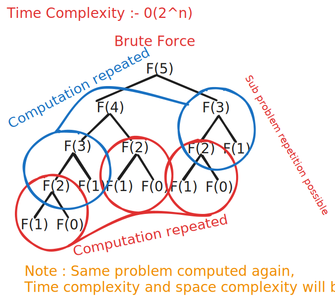
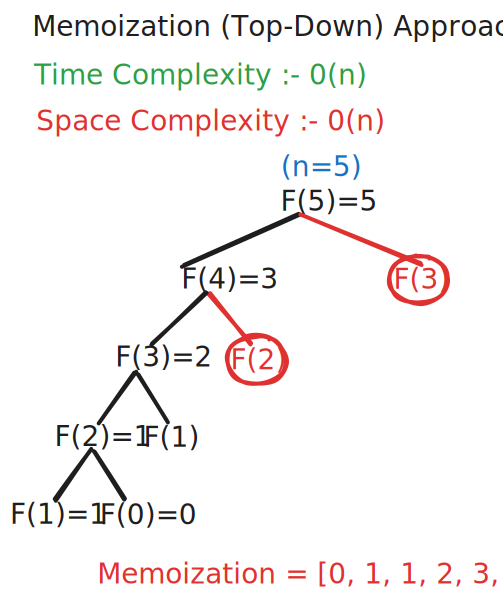
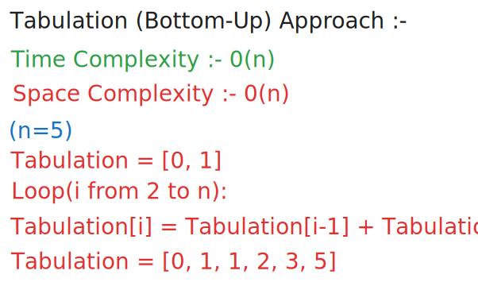
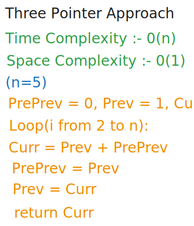

### Fibonacci Sequence :-First and second number 0 and 1 can be used to generate fibonacci number by keep on adding previous 2 number.

**Example : 0 1 1 2 3 5 8 13 21**

**Problem Statement** : Get nth fibonacci number, where n = 5.

> **Approaches**
> * Brute force `Complexity => Time : O(2^n) | Space : Unknown`
> * Memoization (Top-Down) `Complexity => Time : O(n) | Space : O(n)`
> * Tabulation (Bottom-Up) `Complexity => Time : O(n) | Space : O(n)`
> * Space optimization `Complexity => Time : O(n) | Space : O(1)`

**Brute force Approach**

**Memoization (Top-Down) Approach**

**Tabulation (Bottom-Up) Approach**

**Space Optimization (Three Pointer Approach)**

