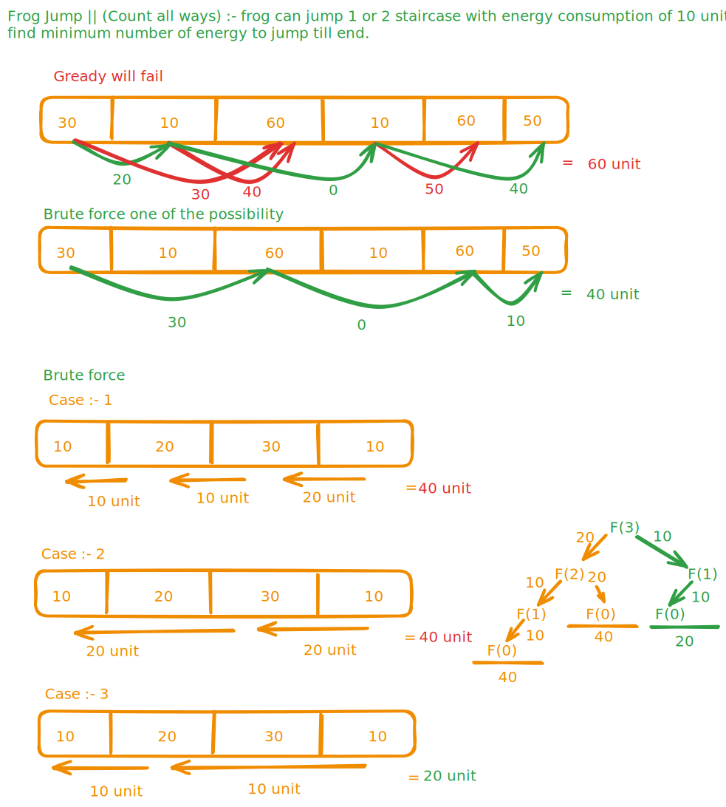

### Jump with minimum energy consumption :- 

**Example : 30, 10, 60, 10, 60, 50**

**Problem Statement** : Frog Jump

> **Recursion relation**
> * Express everything in terms of index.
> * Try all possible ways (Restriction :- Minimum energy).
> * Take minimum of all possibilities.`

**Brute force Approach**

**Memoization (Top-Down) Approach**

**Tabulation (Bottom-Up) Approach**

**Space Optimization (Three Pointer Approach)**

> **Summary**
> * Brute force `Complexity => Time : O(2^n) | Space : Unknown`
> * Memoization (Top-Down) `Complexity => Time : O(n) | Space : O(n)`
> * Tabulation (Bottom-Up) `Complexity => Time : O(n) | Space : O(n)`
> * Space optimization `Complexity => Time : O(n) | Space : O(1)`
